

# OMalley's Cat Flap Opener — Build Guide

**A standalone gadget that lifts the cat flap when OMalley hops onto his shelf, on either side, then gently lowers it after he's gone.**

*Version 1 · 2026-09-28 · Project repo: <https://github.com/beveradb/cat-flap-opener>*

**How to use this guide.** Read it end to end once before buying anything. Each build step says what you'll need, what to do and how to check it worked, in that order. Printed, it works as a workbench checklist: tick the ☐ boxes as you go.

## Contents

1. [What you're building](#1-what-youre-building)
2. [How it behaves](#2-how-it-behaves)
3. [Safety design](#3-safety-design)
4. [Shopping list](#4-shopping-list)
5. [Tools and things you already own](#5-tools-and-things-you-already-own)
6. [Measure your window first](#6-measure-your-window-first)
7. [Build steps](#7-build-steps), 12 stages from bench prototype to OMalley's first trip
8. [Troubleshooting](#8-troubleshooting)
9. [Maintenance](#9-maintenance)
10. [Appendices](#10-appendices): pin map, settings, costs

## 1. What you're building

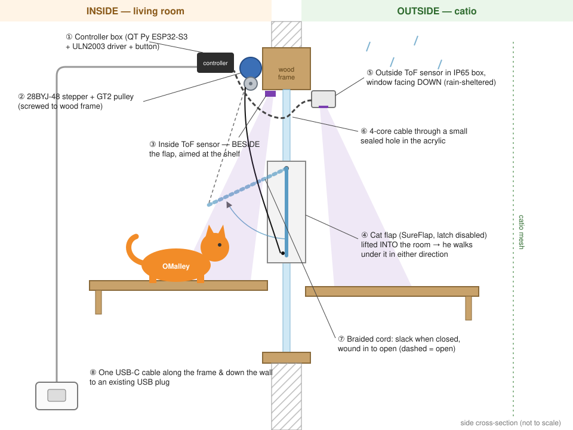

The whole system is four parts on the window plus one USB cable:

| # | Part | Where | What it does |
|---|---|---|---|
| ① | **Controller box** (80×50×26 mm, black) | Inside, on the wooden frame | The brain. A QT Py ESP32-S3 microcontroller and a ULN2003 motor driver. It reads both sensors and decides when to open. |
| ② | **Stepper motor + pulley** | Inside, on the frame above the flap | Winds a cord in to lift the flap and lets it out to lower it. It moves to an exact position every time. |
| ③ | **Inside distance sensor** (VL53L1X) | Inside, on the frame *beside* the flap | A tiny laser rangefinder aimed at the inside shelf. "Something closer than the empty shelf" means "cat". |
| ⑤ | **Outside distance sensor** | Catio side, in a small sealed box | Same sensor, aimed at the catio shelf, so he gets help coming back in too. |
| ⑦ | **Braided cord** | Pulley → bottom edge of the flap | Hangs slack when the flap is closed, so the flap still swings freely by hand. |
| ⑧ | **USB-C cable** | Frame → down the wall → any USB plug | The only wire you'll see. Everything runs on 5 V. |

**Why no camera?** We only need to know whether something is on the shelf, not *what* it is. If a hand or a bag triggers it, the flap just opens, which does no harm. A distance sensor has no model to train, works in the dark and doesn't mind the lighting. It's also about 1 cm square. Cameras for watching him are planned as a separate, optional later project (see `docs/future-cameras.md`).

**Why a stepper motor and cord?** A stepper counts its own steps, so "open" is always exactly the same position. There's nothing to time or tune, and it can't over-wind. The cord only *pulls*, and gravity does the closing. If the power fails with the flap closed, you're left with a normal cat flap.

## 2. How it behaves


In plain English:

1. **Waiting.** It checks both shelves 10 times a second.
2. **He hops up.** If either sensor sees something for **0.3 s in a row**, the flap starts opening. Rain drops and a hand swiping past are too brief to count.
3. **Opening** takes about **4–6 s**. There's a gap to sniff through almost at once, and he can take his time.
4. **Holding.** It stays open while he's on either shelf, **plus 20 seconds** after both shelves are clear. He's between the two sensors while he's in the tunnel, and he's sometimes slow, so the 20 s is deliberately generous.
5. **Closing.** The cord is let out slowly (about 6 s) and the flap lowers under its own weight. **If either sensor sees him again while it's closing, it reverses and reopens straight away.**
6. **Stuck-open protection.** If it has been open for **2 minutes straight** (a bag on the shelf, or OMalley napping there), it closes. It then ignores that sensor until it reads "empty" again.
7. **Cooldown.** After closing, it waits 3 s before it can reopen, so it can't flap about.

All of these numbers are settings in one file and easy to change (see [Appendix B](#appendix-b-settings)).

**The button on the box:**

| Press | Does |
|---|---|
| Short press | Runs one open → hold → close cycle (test/demo) |
| Hold 3 s, with both shelves empty | Learns the empty-shelf distances (calibration) |

**The status light** (the QT Py's built-in colour LED): dim green means idle, blue means open or moving, red flashes mean a sensor problem.

## 3. Safety design

**Nothing on the window can hurt OMalley.** The design goals and how each one is met:

- **Only 5 V anywhere near him.** It's USB power, with no mains wiring and no big batteries.
- **A deliberately weak motor.** The 28BYJ-48 can lift a flap weighing a few tens of grams through its gearbox, but it can't pinch or trap a paw with any real force. If something resists, it simply stalls.
- **Gravity closes the flap**, just as it does when he pushes through today. The motor only controls how *slowly* it comes down.
- **A 20 s grace period** after both shelves are clear, and **it reopens if he reappears while it's closing.**
- **Braided nylon cord, not fishing line.** Loose monofilament is a real hazard to cats (chewing, swallowing, tangling). This cord is short, thick enough to see and anchored at both ends. It's taut when the flap is open and only slightly slack when closed.
- **All electronics are boxed,** and cables are clipped flat to the frame and wall.

**What happens if something goes wrong:**

| Failure | Result |
|---|---|
| Power cut while closed | A normal cat flap |
| Power cut while open | The gearbox probably holds it open. The catio is enclosed, so that's acceptable; unplug and replug to recover. |
| A sensor stops responding | That sensor counts as "clear" and the light flashes red. The other side keeps working. |
| Something sits on a shelf | Closes after 2 min and ignores that shelf until it's clear |
| He swats the cord | Nothing happens. The motor doesn't react to the cord being pulled, and the cord is anchored at both ends. |

## 4. Shopping list

Two orders. The carts are already built in the Playwright browser, but **nothing is bought yet.**

### Order A: Adafruit (core electronics), $77.25 + shipping

| | Item | Qty | Price | Why |
|---|---|---|---|---|
| 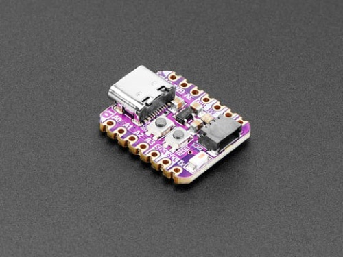 | **Adafruit QT Py ESP32-S3** (8 MB flash, no PSRAM), PID 5426 | 2 | $25.00 | The brain. One is for bench testing and stays spare; the other goes in the final box. Thumb-sized, with a plug-in sensor socket. |
| 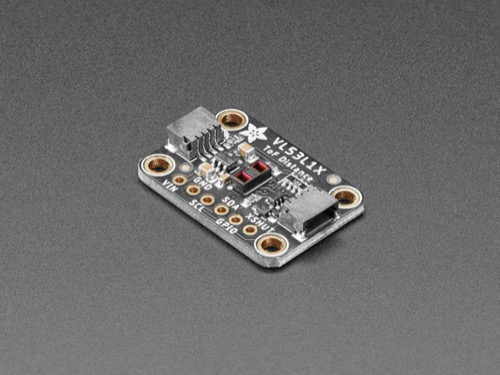 | **VL53L1X time-of-flight distance sensor**, STEMMA QT, PID 3967 | 3 | $44.85 | The "is he on the shelf?" sensors: one inside, one outside and one spare (the outdoor one is the most likely to die). |
| 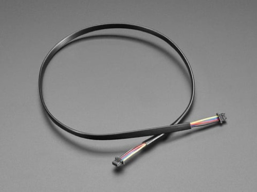 | **STEMMA QT cable, 400 mm** (PID 5385) and **200 mm** (PID 4401) | 2 + 2 | $5.50 | Plug-in, solder-free cables from the QT Py to the inside sensor. Two lengths, so you can pick whichever suits the mounting spot. |
| 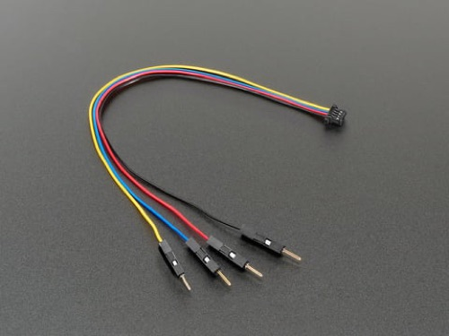 | **STEMMA QT → male header cable, 150 mm**, PID 4209 | 2 | $1.90 | Plugs into the outside sensor. Its other end is spliced onto the long 4-core cable. Also handy for breadboarding. |

### Order B: Amazon, $127.66

**Build parts:**

| | Item | ASIN | Price | Why |
|---|---|---|---|---|
| 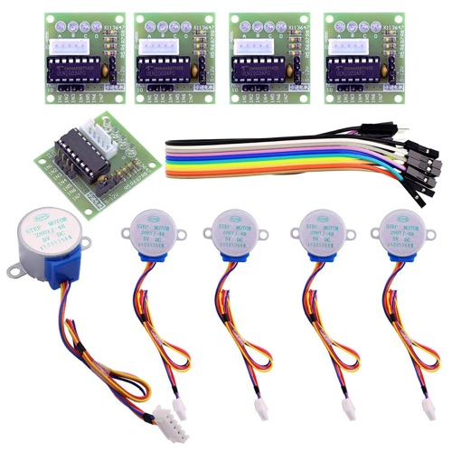 | **ELEGOO 5× 28BYJ-48 stepper + ULN2003 driver** | B01CP18J4A | $14.99 | The motor and its driver board. You get five, so there are plenty of spares. |
| 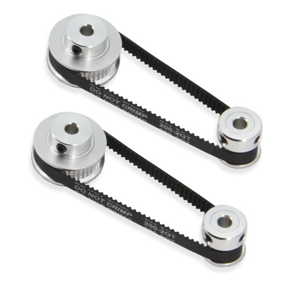 | **GT2 pulleys, 20T + 40T, 5 mm bore** (plus belts you won't need) | B09JWKLJW9 | $11.89 | The cord spool. **Start with the 40-tooth**; it opens about twice as fast. The 20-tooth gives more pulling force if the flap turns out to be stiff. |
| 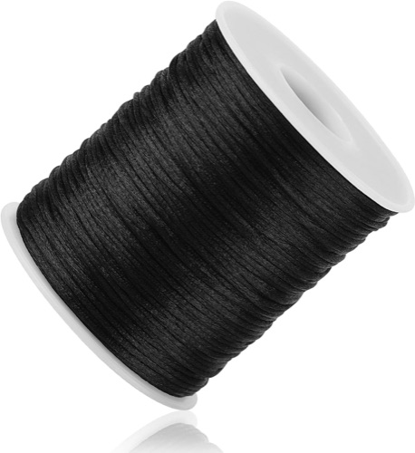 | **1 mm black braided nylon cord**, 100 yd | B0CNPST7D9 | $5.79 | The pull cord. It's strong and visible, and nothing like fishing line. |
| 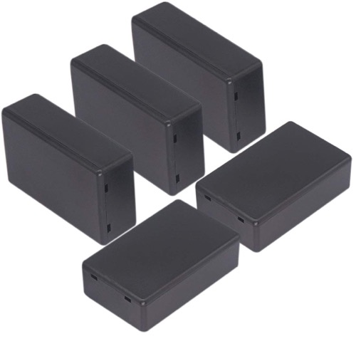 | **Zulkit project boxes 80×50×26 mm**, 5-pack | B07Q14K8YT | $7.29 | The controller box, with spares for mistakes. |
| 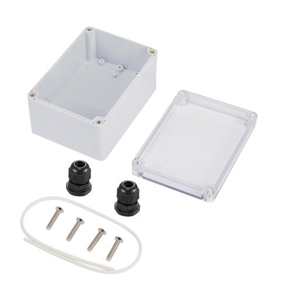 | **IP65 box 68×58×33 mm, clear lid** (includes 2 cable glands) | B0CT5H9KPC | $4.99 | Weatherproof housing for the outside sensor |
| 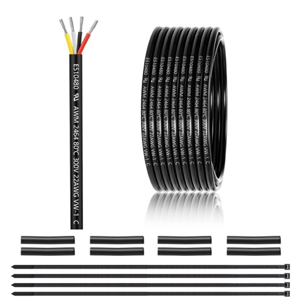 | **22 AWG 4-conductor cable**, 25 ft | B0CFJXMDT3 | $12.99 | Connects the outside sensor to the controller (about 1 m used) |
| 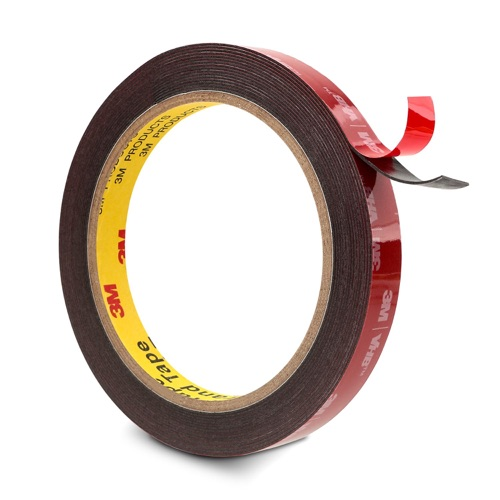 | **3M VHB double-sided tape**, black | B0CHDVNS5T | $11.99 | Sticks the sensors and boxes to the frame neatly, with no screws in the acrylic |

**Electronics starter kit** (for this build and future ones):

| | Item | ASIN | Price | Why |
|---|---|---|---|---|
| 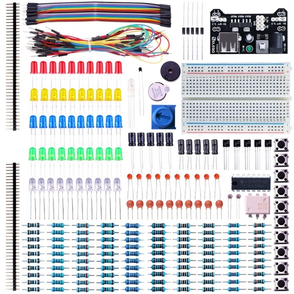 | **ELEGOO Electronics Fun Kit**: breadboard, buttons, LEDs, resistors, header pins… | B01ERP6WL4 | $9.99 | Breadboard for the bench prototype, plus the push button for the box |
| 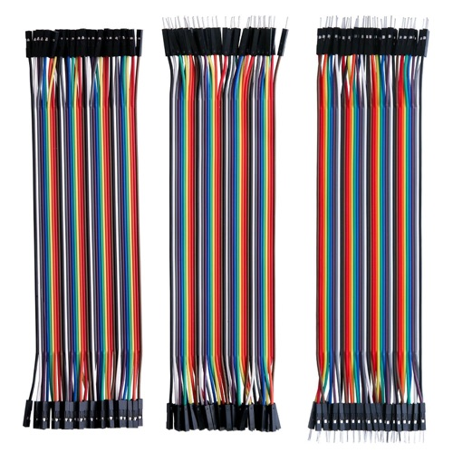 | **ELEGOO 120 Dupont jumper wires** (M-M, M-F, F-F) | B01EV70C78 | $6.98 | Breadboard wiring |
|  | **Fermerry 22 AWG stranded wire**, 6 colours × 10 ft | B089CQHRDT | $12.79 | Neat wires inside the final box |
| 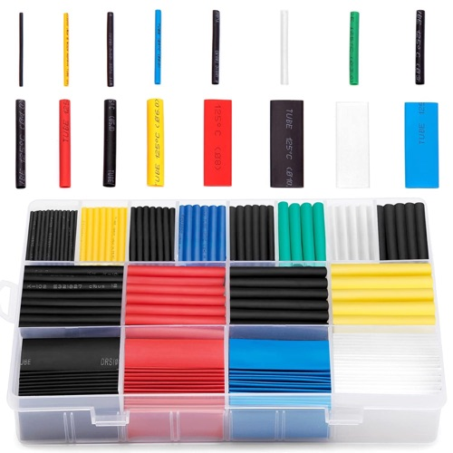 | **Ginsco heat-shrink tubing kit** | B01MFA3OFA | $7.99 | Insulates the splices (shrink with the side of the soldering iron or a lighter) |
| 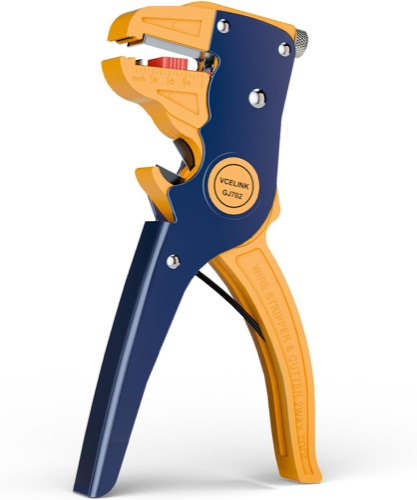 | **VCELINK automatic wire stripper** | B08G48R47N | $9.99 | Clean strips on 22 AWG wire |
| 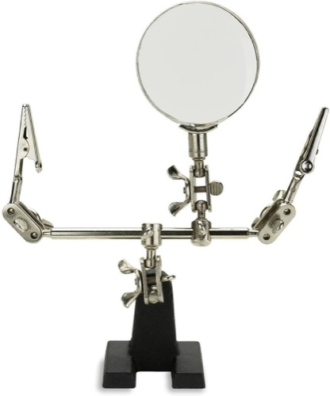 | **NEIKO helping hands** with magnifier | B000P42O3C | $9.99 | Holds wires while you solder splices |

**Total: about $205 + Adafruit shipping.** About $147 of that is the build itself; the rest is the reusable starter kit.

## 5. Tools and things you already own

Found in your Amazon order history. **None of this is being bought again.**

| Already have | Used for |
|---|---|
| MEAKEST 60 W soldering iron kit (solder, flux, pump, tweezers, stand) | All soldering |
| HTM-201 silicone repair mat, Weller brass tip cleaner | A safe surface to solder on |
| iFixit Pro Tech Toolkit | Small screwdrivers (grub screw on the pulley, box screws) |
| AstroAI multimeter | Checking the 5 V supply and continuity of the long cable |
| Adoric digital caliper | Taking the window measurements precisely |
| Drill + ENERTWIST / DEWALT bit sets | Box holes, the acrylic cable hole and a tiny hole in the flap |
| Jewelry pliers set (with wire cutters) | Snipping wires and header pins |
| Loctite super glue gel, Gorilla clear adhesive, hot glue gun | Securing knots and the button, sealing the cable hole |
| Bates nail-in cable clips (white), Velcro, gaffer tape | Routing the USB cable down the wall |
| Sabrent 10-port USB charger / Apple 40 W / spare USB plugs | 5 V power (any 1 A+ USB port is enough) |
| Anker USB-C to USB-C cables, 6 ft | Power cable (measure the run first; see §6) |
| CeSunlight clamp lamp | Light for the workbench |

**You may also need** a couple of small wood screws (#4–#6, ½") to fix the motor's mounting tabs to the frame. VHB tape works if you'd rather not drill.

## 6. Measure your window first

Do this **before you order**; it takes 10 minutes with the caliper and a tape measure. These numbers decide the pulley size, the cable lengths and where things mount.

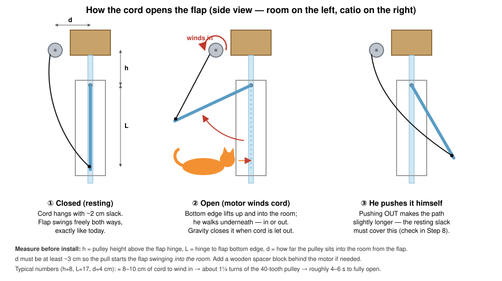

| ☐ | Measure | Typical | Yours |
|---|---|---|---|
| ☐ | **L**: flap hinge to the flap's bottom edge | 15–18 cm | |
| ☐ | **h**: how far above the hinge the pulley can sit (the underside of the wooden frame) | 5–10 cm | |
| ☐ | **d**: how far into the room the pulley will sit, measured from the flap's surface. **Needs to be ≥ 3 cm**; use a spacer block if the frame is flush with the acrylic. | 3–5 cm | |
| ☐ | Inside: frame → inside shelf surface (vertical) | 30–50 cm | |
| ☐ | Outside: frame → catio shelf surface (vertical) | 30–50 cm | |
| ☐ | Where will the controller box sit, and how far is it from a USB plug along the wall? (≤ 6 ft means you can use your existing Anker cable) | | |
| ☐ | Is there space **beside** the flap (10–15 cm left or right) on the frame for the inside sensor? | | |
| ☐ | Can you drill a ~7 mm hole in the acrylic near the top corner for the outside cable, or is there an existing gap? | | |
| ☐ | Photos of both sides, for the repo | | |

**How much cord gets wound in?** Roughly `√(d² + (h+L)²) − √((d − L·sin θ)² + (h + L·cos θ)²)` plus about 2 cm of slack, where θ is how far open you want the flap (60–75° is plenty). You don't need to calculate it: the firmware lets you jog the motor and save "open" by eye (Step 11). The formula just confirms the 40-tooth pulley needs only about 1–1½ turns.

## 7. Build steps

**The plan.** Get everything working on the desk first (Steps 1–3). Then build the mechanical parts (Steps 4–7), assemble the final box (Step 8), mount it (Steps 9–10), tune it (Step 11) and introduce OMalley (Step 12).

**About the firmware:** I'll write it and add it to the repo under `firmware/` while the parts ship. It will have unit tests for the behaviour rules and a serial console for testing. You'll only need to install one thing (the PlatformIO extension in VS Code) and click "Upload"; Step 3 walks through it.

### Step 1: Unbox and check (15 min)

- [ ] Check each Adafruit and Amazon item against the §4 lists.
- [ ] Pick one QT Py as the **bench board** (write "B" on it with a marker). The other is the **final board**, and it stays in its bag for now.
- [ ] Plug the bench QT Py into your Mac with a USB-C cable. Its LED should light up; that proves the board and cable work.

### Step 2: Bench prototype on the breadboard (45 min)

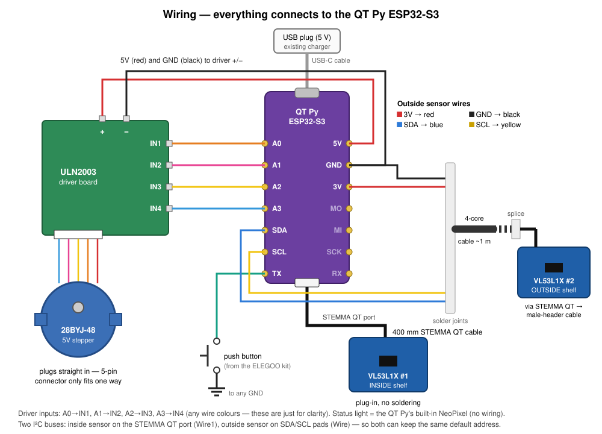

This is the wiring for **both** the bench prototype and the final box. On the bench everything plugs together with jumpers; later it's soldered.

- [ ] **Solder headers onto the bench QT Py.** Use the header strips supplied with the board (or snap two 7-pin lengths off the ELEGOO kit's strip). Push the long ends into the breadboard, sit the QT Py on top, and solder all 14 pins. The breadboard holds them straight.
- [ ] Put the QT Py across the breadboard's centre channel.
- [ ] **Motor driver:** use 4 female-to-male jumpers from the QT Py pins **A0, A1, A2, A3** to the ULN2003's **IN1, IN2, IN3, IN4**, in that order.
- [ ] **Driver power:** a jumper from QT Py **5V** to the ULN2003 **+**, and another from QT Py **GND** to the ULN2003 **−**.
- [ ] **Motor:** plug the 28BYJ-48's white 5-pin plug into the ULN2003 (it only fits one way).
- [ ] **Inside sensor:** plug a STEMMA QT cable from the QT Py's STEMMA socket (on its underside, at the end opposite the USB port) into either socket on a VL53L1X. No soldering needed.
- [ ] **Outside sensor (bench version):** plug a STEMMA QT → male-header cable into a second VL53L1X and push its four pins into the breadboard:
  - **red** → QT Py **3V**
  - **black** → **GND**
  - **blue** → **SDA**
  - **yellow** → **SCL**
- [ ] **Button:** put a tactile button from the ELEGOO kit on the breadboard. Wire one leg to QT Py **TX** and the diagonally opposite leg to **GND**.
- [ ] Peel the clear protective film off both sensors' faces (if there is one; it's a small tab).

**Check:** nothing gets warm when you plug in USB. The ULN2003's four red LEDs stay dark or blink only once the firmware is running.

### Step 3: Flash firmware and bench test (30 min)

- [ ] Install **VS Code** and the **PlatformIO IDE** extension.
- [ ] `git clone https://github.com/beveradb/cat-flap-opener` and open the `firmware/` folder in VS Code.
- [ ] Plug in the bench QT Py and click **Upload** (→) in the PlatformIO toolbar. If it won't connect, hold the board's **BOOT** button, tap **RST**, release BOOT, then upload again.
- [ ] Open the **Serial Monitor**. You should see both distances printing about 10 times a second, e.g. `in=1234mm out=987mm state=CLOSED`.

**Bench test checklist.** Point both sensors at the ceiling and hold the "hold 3 s" calibration with your hands clear. Then:

| ☐ | Do this | Expect |
|---|---|---|
| ☐ | Wave a hand quickly past a sensor | **Nothing happens** (it's shorter than 0.3 s) |
| ☐ | Hold a hand ~20 cm above the inside sensor | The motor turns (the "open" direction) and the LED turns blue |
| ☐ | Take your hand away and start a timer | The motor reverses after about **20 s** |
| ☐ | Put your hand back while it's reversing | It **reverses back to open** straight away |
| ☐ | Leave a book over one sensor | It opens, then closes after **2 min**. Remove the book, wait, put it back: it opens again. |
| ☐ | Repeat with the **outside** sensor | Same behaviour |
| ☐ | Short-press the button | One full open → hold → close cycle |
| ☐ | Unplug the outside sensor mid-run | The LED flashes red and the inside sensor still works |
| ☐ | Touch the motor after idling a few minutes | Cold (coils are switched off when closed) |

### Step 4: Pulley and cord (15 min)

- [ ] Slide the **40-tooth pulley** onto the motor shaft, flange side outward, as close to the motor body as it will go without rubbing.
- [ ] Turn the shaft until one of the pulley's grub screws faces a **flat** on the shaft, then tighten it firmly with an iFixit hex bit. Tighten the second grub screw too.
- [ ] Cut about **60 cm of cord**. Tie one end around the pulley hub, between the flanges, with a **clove hitch** pulled tight. Put a drop of super glue gel on the knot.
- [ ] Wind 2 turns on by hand, neatly, between the flanges. That leaves spare cord on the spool in case you need to re-tie later.
- [ ] Seal the other end of the cord with a quick pass of a lighter flame so it can't fray.

**Check:** pull the cord firmly. The pulley shouldn't slip on the shaft, and the knot shouldn't move.

### Step 5: Prepare the flap (15 min)

- [ ] If the flap will lift out (SureFlap flaps usually unclip at the hinge pins), take it out. Otherwise, hold a block of wood behind it while you drill.
- [ ] Mark a point **centred left-to-right, 5 mm up from the bottom edge.**
- [ ] Drill a **1/16" (1.5 mm)** hole: slow speed, light pressure, with a scrap of tape over the spot to stop the bit wandering.
- [ ] Thread the cord through **from the room side** and tie a **figure-eight stopper knot** on the catio side. Pulling from the room then pulls the knot against the flap. Put a drop of super glue on the knot. (Leave the cord long for now; it's trimmed in Step 10.)

### Step 6: Outside sensor box (30 min)

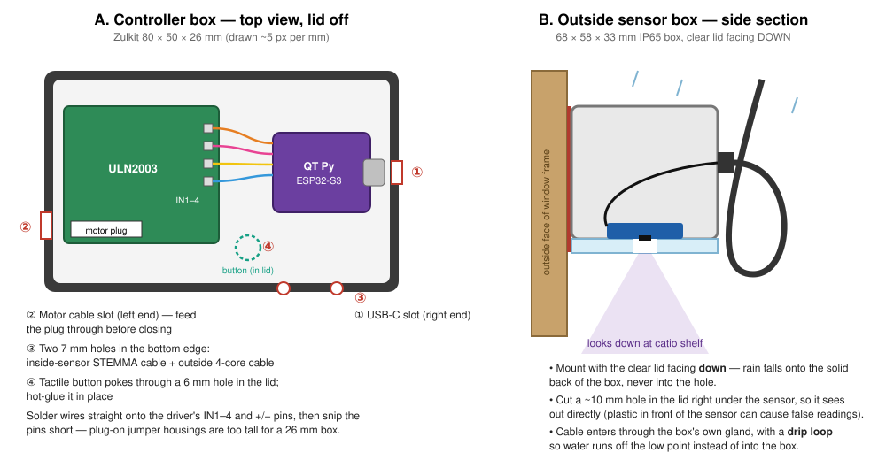

- [ ] On the IP65 box's **clear lid**, mark a spot about 1 cm from one edge. Drill a small pilot hole, then open it up to **~10 mm** (step up through the bit sizes). Go slow; the plastic cracks if you rush.
- [ ] Fit one of the box's supplied **cable glands** in a side wall, near the top when the box is mounted (drill to the gland's thread size).
- [ ] Stick the VL53L1X to the **inside of the lid** with a small square of VHB. Put the sensor's black window **centred over the hole** and the STEMMA socket facing the gland.
- [ ] Plug the **STEMMA QT → male-header** cable into the sensor and feed its header end out through the gland. It's spliced to the long cable in Step 7.

### Step 7: Route and build the outside cable (45 min)

- [ ] Decide the cable path from the controller box position → through the acrylic → to the outside box. Cut the **4-core cable** to that length **plus 20 cm**.
- [ ] **Hole in the acrylic** (skip this if there's a usable gap): drill **~7 mm** near a top corner, away from the flap. Stick masking tape on both faces first, use slow speed and light pressure, and support the panel from behind.
- [ ] Push the cable through. Seal it on both faces with a bead of **Gorilla clear adhesive**, and leave that to cure (check the tube for the time).
- [ ] **Splice at the sensor end.** Cut the male pins off the STEMMA cable, strip 5 mm from each of the 8 wire ends, and slide a small piece of heat-shrink onto each wire before joining. Match them up:

| STEMMA wire | Signal | 4-core wire (typical: check yours and **write your mapping here**) |
|---|---|---|
| red | 3V | red → ________ |
| black | GND | black → ________ |
| blue | SDA (data) | white → ________ |
| yellow | SCL (clock) | green → ________ |

- [ ] Twist each pair together, solder it, slide the heat-shrink over the joint and shrink it. Then put one larger piece of heat-shrink over all four joints.
- [ ] Tighten the gland nut and screw the lid on. Mount the box on the **outside face of the frame** with VHB, **clear lid facing down**, so the sensor looks down at the catio shelf. Leave a **drip loop** (a U-bend below the gland) in the cable.

**Check:** with the multimeter on continuity (beep) mode, test each 4-core wire end-to-end against the colour at the far end. There should be 4 beeps, and no beep between any two different wires.

### Step 8: Final controller box (60–90 min)

Now repeat the bench wiring on the **final** QT Py, soldered this time, so it fits in the 26 mm-deep box. See the controller box layout in diagram A above.

- [ ] **ULN2003 prep:** snip the IN1–IN4 and +/− header pins down to about 3 mm with the jewelry cutters. Plug-on jumper housings are too tall for the box.
- [ ] Cut 6 lengths of 22 AWG wire, each about 8 cm, using different colours. Solder:
  - QT Py **A0 / A1 / A2 / A3** → ULN2003 **IN1 / IN2 / IN3 / IN4**
  - QT Py **5V** → ULN2003 **+**
  - QT Py **GND** → ULN2003 **−**
- [ ] Solder the **4-core outside cable** to the QT Py pads:
  - red → **3V**
  - black → **GND** (sharing the pad with the ULN2003 ground is fine)
  - white → **SDA**
  - green → **SCL**
- [ ] **Button:** drill a 6 mm hole in the lid. Solder two short wires from the button to **TX** and **GND**, push the button through the hole from inside and hot-glue it.
- [ ] **Box holes** (clean them up with a craft knife):
  - a USB-C slot in the right end, lined up with the QT Py's port
  - a slot at the left end for the motor cable (feed the motor's plug through from outside, then plug it into the ULN2003)
  - two 7 mm holes in the bottom edge, for the inside sensor's STEMMA cable and the outside 4-core cable
- [ ] Stick both boards to the box floor with small VHB squares, with the QT Py's USB port lined up to its slot.
- [ ] Put a **knot or a zip tie** on the 4-core and motor cables just inside the box, so a tug can't pull on the solder joints.
- [ ] Plug in USB and run the **Step 3 bench checklist again** before closing the lid.

### Step 9: Mount on the window (45 min)

- [ ] **Motor:** mount it on the inside face of the wooden frame, above the flap and at least **3 cm into the room** from the flap (distance **d**). Add a wood spacer block if needed. Fix the two mounting tabs with small wood screws, with the **shaft pointing into the room**, so the pulley turns in a plane parallel to the window and the cord drops straight down from it.
- [ ] **Inside sensor:** stick it with VHB to the frame **10–15 cm to one side of the flap**, angled so it looks at the part of the shelf where he sits in front of the flap. **It must not see the flap or cord** as the flap swings up (see Step 11's check). Plug in its STEMMA cable.
- [ ] **Controller box:** VHB it to the frame beside the motor.
- [ ] **USB cable:** route it along the frame and down the wall with the Bates clips, into your USB plug.

### Step 10: Connect the cord (10 min)

- [ ] With the flap **closed** and the motor at its home position (just powered on), take the cord from the pulley to the flap. Tie it off so there's **about 2 cm of slack** when the flap hangs straight down.
- [ ] **Push the flap outward by hand** (as OMalley would, going out) as far as it goes. The cord must **not** go tight at any point; if it does, add a bit more slack.
- [ ] Push it **inward** by hand: the cord simply goes slacker.
- [ ] Trim the spare cord, leaving about 3 cm past the knot, and seal the end with a flame.

### Step 11: Calibrate and tune (30 min)

- [ ] **Empty-shelf calibration:** with both shelves clear (and OMalley elsewhere), **hold the button for 3 s**. The LED flashes to confirm, and the Serial Monitor shows the learned distances.
- [ ] **Set the open position:** in the Serial Monitor, use the jog commands (`u` = wind in 100 steps, `d` = let out 100 steps) until the flap is open about 60–75°, enough for him to walk under easily. Type `save` to store it.
- [ ] **Short-press the button** a few times and watch full cycles. Check that:
  - the cord winds evenly between the pulley flanges
  - the flap closes fully and the cord goes slack again
  - opening takes about 4–6 s (swap to the 20-tooth pulley only if the motor struggles or skips)
- [ ] **Critical check:** while the flap is open, the Serial Monitor's `in=` reading must **not** change as the flap moves. If it does, the inside sensor can see the flap, so re-aim it further to the side.
- [ ] **Outside:** sit something cat-sized (a cushion or a bag of rice) on the catio shelf and confirm it opens. Try it again on a rainy day.

### Step 12: Introduce OMalley (over a week)

- **Days 1–2:** leave the automatic mode off (`auto off` in the console). Run a few short-press cycles **while he's in the room but not near the flap**, and reward him with treats, so the whirr and the moving flap become boring.
- **Days 3–4:** turn automatic mode on (`auto on`). Stay nearby for his first few trips. If he startles, go back a step.
- **Days 5–7:** it runs on its own. Glance at the serial log or the LED now and then. Tune the 20 s grace, the 0.3 s trigger or the margin if he's getting "caught" or it opens too often.

**You're done when** he goes out and back in, on his own, several days in a row, and you haven't walked over to hold the flap once. 🐈

## 8. Troubleshooting

| Symptom | Likely cause | Fix |
|---|---|---|
| Nothing happens, no LED | No power, or a charge-only cable | Try another USB cable and port; check for 5 V between the QT Py's 5V and GND pads with the multimeter |
| The ULN2003 LEDs flicker but the motor only buzzes | Motor wires swapped, or IN1–4 in the wrong order | Check A0→IN1 … A3→IN4 in order |
| The motor turns the wrong way | The pulley winds the other way on your mounting | Type `reverse` in the console and `save` |
| It opens with nobody there | The empty-shelf calibration is stale (something was moved) | Re-calibrate: hold the button for 3 s with the shelves clear |
| It stays open far too long | A sensor can see the flap or cord (inside), or a plant or leaf (outside) | Re-aim the sensor; check its `in=`/`out=` reading while the flap is open |
| It opens in heavy rain | The outside box is too exposed | Lengthen the 0.3 s trigger to 0.5 s, or move the box further under the roof |
| Red flashing LED | A sensor isn't responding | Reseat the STEMMA plug; check the outside cable's continuity (Step 7 check) |
| The motor skips or stalls near "fully open" | The cord pulls almost along the flap's surface, so there's too little leverage | Reduce the open position a little, increase **d**, or switch to the 20-tooth pulley |
| The flap doesn't close fully | The cord is still slightly taut at "home" | Let out a few hundred steps and re-save home (`d`, then `home`) |
| After a power cut the flap is stuck open | It rebooted thinking the flap was closed | In the console, type `d` repeatedly until the flap is down with about 2 cm of slack, then type `home` to re-set the home position |

## 9. Maintenance

- **Monthly:** check the cord for fraying or chew marks, and replace it if there are any (there's 100 yards of it). Also wipe both sensor windows with a dry cloth.
- **After storms:** check the outside box for water inside.
- **Yearly:** check the pulley grub screws are still tight.

## 10. Appendices

### Appendix A: Pin map

| QT Py pad | Connects to | Notes |
|---|---|---|
| A0, A1, A2, A3 | ULN2003 IN1, IN2, IN3, IN4 | Stepper coils; 3.3 V logic drives the ULN2003 fine |
| 5V | ULN2003 + | USB 5 V passes straight through; the motor draws about 250 mA while moving |
| GND | ULN2003 −, outside-cable GND, button | One common ground |
| 3V | Outside-cable red (sensor power) | The sensor draws about 20 mA |
| SDA, SCL | Outside sensor (Arduino `Wire`) | I²C bus 0 |
| STEMMA QT socket | Inside sensor (Arduino `Wire1`) | I²C bus 1, so both sensors can keep address 0x29 |
| TX | Button → GND | Internal pull-up; reads "pressed" when low |
| (built-in) | NeoPixel status LED | No wiring |

### Appendix B: Settings

| Setting | Default | What it means |
|---|---|---|
| Trigger time | 0.3 s | How long a sensor must see something before opening |
| Trigger margin | 50 mm | How much closer than the empty shelf counts as "something" |
| Grace time | 20 s | How long it stays open after both shelves are clear |
| Max open | 2 min | Closes after this long, and ignores that shelf until it clears |
| Cooldown | 3 s | Minimum gap between closing and reopening |
| Open position | set in Step 11 | Motor steps from home to open |
| Opening speed / closing speed | ~15 rpm / ~10 rpm | Closing is slower so the flap lowers gently |

### Appendix C: Cost summary

| | Amount |
|---|---|
| Adafruit (electronics) | $77.25 + shipping |
| Amazon (build parts) | $69.93 |
| Amazon (starter kit) | $57.73 |
| **Total** | **≈ $205 + shipping** |
| Saved by using things you already own | ≈ $95 |
